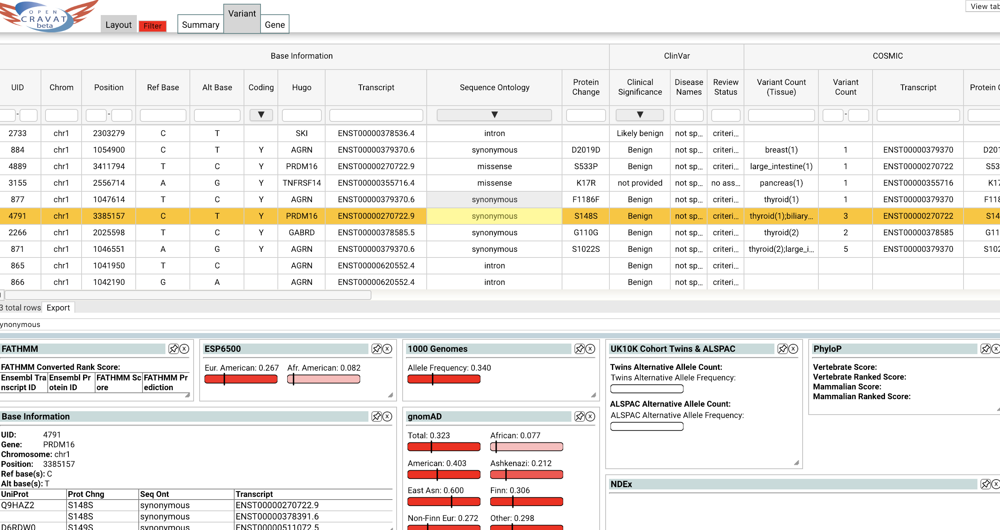
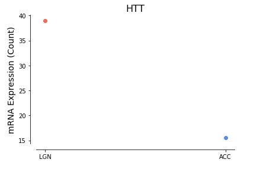

# An open store for variant and gene prioritization tools

### Hackathon Members
Kymberleigh Pagel, Johns Hopkins University, Baltimore MD 21218, <kpagel1@jhu.edu>  <br>
Anna Chang, Johns Hopkins University, Baltimore MD 21205, <achang44@jhmi.edu> <br>
Zhi Liu, NIH, Bethesda MD 20892, <zhi.liu@nih.gov> <br>
Summer Rankin, Booz Allen Hamilton, Rockville MD 20852, rankin_summer@bah.com, summer.rankin@fda.hhs.gov <br>
Danielle Rubin, NIH, Bethesda MD 20892, <danielle.rubin@nih.gov>  <br>
Chris Shin, NIH/NIAID, Bethesda MD 20892, <chris.shin@nih.gov> <br>


## Introduction to Open-CRAVAT

[Open-CRAVAT](https://github.com/KarchinLab/open-cravat) is a python package that performs genomic variant interpretation. The modular and locally-installed command-line or GUI interface allows for  annoations of gene- and variant-level impact, interactions, conservation, and scoring. In this work, we advance the platform by the addition of new annoation sources to assist in the interrogation of genetic variation.

 
*Example of the Open-CRAVAT interface*

### Annotators
As of May 2019, the Open-CRAVAT Store has 65 annotators, converters, and visualization widgets available for use. Annotators range from genomic feature insights to population-level frequencies and clinical interpretations. Convertors take input in forms other than VCF (Variant Cell Format), such as dbSNP rsid and 23andMe formats, and make them compatible to Open-CRAVAT. There are currently three visualization widgets that can be downloaded: a summary of the top genes ranked by total variants, a haplotype information widget, and an embedded interactive genome visualization component developed by [Integrative Genomics Viewer (IGV)](https://github.com/igvteam/igv.js). 


*Home Page for the Open-CRAVAT store*

### Installation

For local installation on Mac and Windows see the Quickstart guide here: https://github.com/KarchinLab/open-cravat/wiki/quickstart

OpenCRAVAT developer tutorial is available here: https://github.com/KarchinLab/open-cravat/wiki/4.-Developer-Tutorial-(Annotators)

## Hackathon Goals

Link to [Hackathon Plan and Workflow Slides](https://docs.google.com/presentation/d/1C_p9PoqMJO7S-NiPOicfLBqYM05rHTgOBhZ2nf1bzoY/edit?usp=sharing)

**(1) Add sources of single cell RNA-seq expression data** <br>

The [Allen Brain Atlas](http://human.brain-map.org/) includes a gene expression survey in multiple adult control brains integrating anatomic and genomic information. The dataset includes more than 62,000 gene probes per profile with around 500 samples per hemisphere across cerebrum, cerebellum and brainstem. In this work, we seek to create an OpenCRAVAT annotator that displays whether a given gene is expressed within different regions of the brain. A potential application for this annotator would include supporting the analysis of variants putatively related to ASD and other neurodevelopmental disease, to ascertain variants within genes that are expressed in the appropriate brain regions. 

**(2) Incorporate additional representation for under-studied populations** <br> 

The [Human Genome Diversity Project](https://www.hagsc.org/hgdp/) from a group of scientists across several labs at Stanford University analyzed DNA from 1,043 individuals among 51 different populations of Africa, Europe, Middle East, South and Central Asia, East Asia, Oceania and the Americas. Details on the individuals included in this collection are described in H. Cann et al. Science 296: 261-262 (2002) and its Supplemental Data; Rosenberg et al. Science 298: 2381-2385 (2002); and Rosenberg et al. PLoS Genetics 1: 660-671 (2005).

In particular, native American and Middle Eastern populations represent populations that are not well represented in OpenCRAVAT. In addition, several subpopulations evaluated in this work do not have representation in either the 1000 Genomes Project or gnomAD, two sources currently available in the OpenCRAVAT store. Due to small sample size n<10 for several subpopulations, we are required to present aggregate per-population allele frequencies to present more meaningful values. 

**(3) Stretch Goal: Identify sources of curated gene lists** <br>
Gene lists are groups of genes known to be influential in the development and/or maintenance of molecular pathways or diseases. We plan on implementing a module that allows users to see if the variants in their uploaded file correspond to a significant proportion of genes in validated gene lists.  

To accomplish these tasks, we will need to carefully format the data and generate several accessory files necessary for incorporation into OpenCRAVAT 
 


### Components necessary to create an annotator 

A cravat annotator consists of a python file, a YAML file, a data directory, and a markdown file. The file structure is 

```text
annotator/
    |───annotator.md
    |───annotator.yml
    |───annotator.py
    └───data/
```

`annotator.md`: The markdown file describes the module to prospective users. 

`annotator.yml`: The YAML file defines the input and output interfaces between an annotator and the rest of OpenCRAVAT. The YAML file specifies what data will be fed to `annotator.py`, and what data OpenCRAVAT should expect `annotator.py` to return. 

`annotator.py`: The python module receives input data describing a single variant/gene, and uses it to lookup additional information specific to that annotator. An `annotator.py` works by extending a provided base class, `BaseAnnotator`, and implementing three instance methods: `setup`, `annotate`, and `cleanup`.


## Progress
### Goal 1: Add sources of single cell RNA-seq expression data 

We will aggregate single cell human RNA-seq data from the [Allen Brain Atlas](https://celltypes.brain-map.org/rnaseq) for genes of known functional significance in the brain to generate gene expression plots across several brain regions.

 <br>
*Raw RNA-Seq data from the Allen Brain Atlas*

The brain regions we are examining are the Anterior Cingulate Cortex (7283 single cells), the Lateral Geniculate Nucleus (1576 single cells), the Medial Temporal Gyrus, and Primary Visual Cortex. 

 <br>
*Example of Huntington Protein expression in two brain regions*

 <br>
*Example of APOE expression in two brain regions*


### Goal 2: Incorporate additional representation for under-studied populations
We will incorporate allele frequencies from [HGDP](https://www.hagsc.org/hgdp/). 

 <br>
*HGDP source data file format*

### Stretch Goal: Assemble sources of well-curated gene lists

* MacArthur lab: https://github.com/macarthur-lab/gene_lists  <br>
  * Drug targets, essential genes, X-linked disease, mode of inheritance, minimum incidental findings 
* ImmPort https://www.immport.org/shared/genelists <br>
* Hallmark gene sets from MSigDB http://software.broadinstitute.org/gsea/msigdb/genesets.jsp?collection=H 
* Network of cancer genes http://ncg.kcl.ac.uk/ 
  * Can generate cancer-type specific gene lists using "Advanced" option
* [NetVenn](https://probes.pw.usda.gov/NetVenn/#&panel1-5) collection of gene sets for humans and animals  https://probes.pw.usda.gov/NetVenn/downloads.php <br>
*SFARI GENE https://www.sfari.org/resource/sfari-gene/


